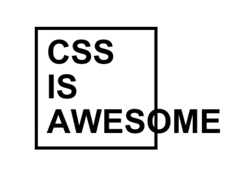

# Putting the ASS in SASS

Everyone already knows how awesome CSS is

<p style="text-align: center">
  
</p>

[SASS](https://sass-lang.com/) made the syntax and working-with-ability awesome.
The SASS acronym stands for: _Syntactically Awesome Style Sheets_

## SCSS

SASS is most often seen used as SCSS

> The SCSS syntax uses the file extension .scss.
> With a few small exceptions, it’s a superset of CSS, which means essentially
> all valid CSS is valid SCSS as well. Because of its similarity to CSS,
> it’s the easiest syntax to get used to and the most popular.

## Let's infuse some ASS (**AWESOME! Style Sheets**) into some HTML shall we?!

And let's be cool and not get pedantic or quibble over the fact that it's the
_syntax_ that is awesome-ified with SASS. It's kinda rare these days to
find CSS instead of SCSS anyway. Let's just get inspired and excited about
making everything... syntax and actual end results
as **AWESOME!!** as we're able... or AaAwA (prounounced ah-ae-ah-wah),
_As awesome as we're able_.

## AWExampleSOME ... !

- David Desandro https://desandro.com/ https://metafizzy.co/
- Diana Adrianne https://diana-adrianne.com/
  - one of [my best open source contributions](https://github.com/cyanharlow/purecss-francine/issues/11)
- The Internet https://css-weekly.com/ https://frontendweekly.co/

## References

- For [JavaScript](https://developer.mozilla.org/en-US/docs/Web/JavaScript)
  and [CSS](https://developer.mozilla.org/en-US/docs/Web/CSS), I use MDN
- For CSS with nice examples, [CSS-Tricks](https://css-tricks.com/)
  - [Flex box](https://css-tricks.com/snippets/css/a-guide-to-flexbox/)
  - [CSS Grid](https://css-tricks.com/snippets/css/complete-guide-grid/)

## Codepen

[Codepen](https://codepen.io/) is great. Sign up with your github account and
start noodling with stuff. You can try some of the
[weekly challenges](https://codepen.io/challenges/) or just browse their
bajillions of public experiments, fork one and tweak it.

One of my favorite things about [S]CSS is that transitions and animations
can be applied to SVG elements like any HTML element. There may be some unique
style attributes. Check out
[animating outlines](https://css-tricks.com/svg-line-animation-works/)
with CSS transitions and the `stroke-dasharray` and `stroke-dashoffset` on
CSS-Tricks.

```css
/* HTML elements use background color and border */
div {
  background-color: blue;
  border: 1px solid yellow;
}

/* SVG paths use fill and stroke */
path {
  fill: blue;
  stroke: yellow;
  stroke-dasharray: 100;
  stroke-dashoffset: 100;
  stroke-width: 1px;
  stroke-linejoin: bevel;
  stroke-linecap: round;
}
```

## Neon Balloons

Check out the animated gif on this Pod Save America
[What-A-Day newsletter](https://crooked.com/newsletters/wad-2-6-the-iowa-of-the-storm/)

<p style="background-color: black; text-align: center;">
  
</p>

We can do this with SVG and CSS animation. I made [the SVG for FREE online
with Figma](https://www.figma.com/file/l7zwPdbnp8insFwWwkr6vH/ballooneon?node-id=0%3A1)
and I really love how clean the exported SVG is.

<p class="codepen" data-height="265" data-theme-id="default" data-default-tab="html,result" data-user="gib" data-slug-hash="WNvbxNx" style="height: 265px; box-sizing: border-box; display: flex; align-items: center; justify-content: center; border: 2px solid; margin: 1em 0; padding: 1em;" data-pen-title="Ballooneon">
  <span>See the Pen <a href="https://codepen.io/gib/pen/WNvbxNx">
  Ballooneon</a> by Gib Reimschüssel (<a href="https://codepen.io/gib">@gib</a>)
  on <a href="https://codepen.io">CodePen</a>.</span>
</p>
<script async src="https://static.codepen.io/assets/embed/ei.js"></script>

<p style="background-color: black; color: white; text-align: center;">
  
  <span style="display: block; padding: 30px; font-size: 24px; font-family: monospace; font-weight: bold;">See you later!</span>
</p>
